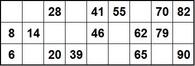

## Задание 15. Flow

### Что нужно сделать
В этом домашнем задании необходимо разработать программу, которая имитирует настольную игру «Лото». Правила этой игры довольно простые:

- В игре принимают участие 90 бочонков. На каждом из бочонков нанесен его номер. Все бочонки кладутся в специальный непрозрачный мешок и перед началом игры перемешиваются.
- Игровая карточка состоит из трёх строк, в каждой из них по девять клеток, пять из которых занимают числа. Пустые клетки для игры не предназначены. Числа на одной карточке не могут повторяться. При желании можно расположить числа на карточке в порядке возрастания (для удобства игрока).
  
- Каждый из игроков берёт себе одну или несколько карт, причём количество игровых карт у каждого из игроков должно быть одинаковым. 
- Ведущий достаёт из мешка один из бочонков. Каждый игрок проверяет, есть ли такое число на его игровых карточках. Если объявленное ведущим число есть на игровой карте, игрок закрывает его специальным маркером. Если такого числа нет, то игрок ждёт объявления следующего числа. 
- Бочонки достаются до тех пор, пока один из игроков не выиграет.

### Существует два варианта игры:
- выигрывает игрок, который первым закроет маркерами все пять чисел любой строки на игровой карте;
- выигрывает игрок, который первым закроет маркерами полностью все числа на одной игровой карте.

### Выберите один из вариантов игры и реализуйте его с помощью корутин и flow:
1. Создайте необходимые классы и объекты. Например, для роли ведущего подойдёт генератор чисел.
2. Распространите данные между этими классами и объектами с помощью различных flow. Выберите наиболее подходящий вариант под эту задачу.
3. Программа должна выполняться в соответствии с описанными правилами и имитировать игру нескольких игроков. Уделите особое внимание следующим пунктам:
- производство данных (передача данных во flow) должно прекратиться после победы одного из игроков;
- все коллекторы должны отписываться от flow, то есть перестать получать данные после победы одного из игроков;
- программа должна корректно завершаться, все корутины должны завершить свое выполнение.
Будьте внимательны и соблюдайте принципы ответственности различных компонентов, чтобы код не был запутанным.

### Советы и рекомендации
1. При возникновении сложностей обратитесь за помощью к проверяющему преподавателю.
2. Воспользуйтесь документацией:
- [общая информация по flow;](https://kotlinlang.org/docs/flow.html#flows)
- [StateFlow;](https://kotlinlang.org/api/kotlinx.coroutines/kotlinx-coroutines-core/kotlinx.coroutines.flow/-state-flow/)
- [SharedFlow;](https://kotlinlang.org/api/kotlinx.coroutines/kotlinx-coroutines-core/kotlinx.coroutines.flow/-shared-flow/)
- [CoroutineScope.](https://kotlinlang.org/api/kotlinx.coroutines/kotlinx-coroutines-core/kotlinx.coroutines/-coroutine-scope/)

**Что оценивается**
- Программа запускается, работает корректно и выводит всю необходимую информацию.
- Выполнены все пункты задания.
- Соблюдены все правила игры из описания
- Функции соответствуют принципам чёрного ящика, выполняют атомарные операции и независимы друг от друга.